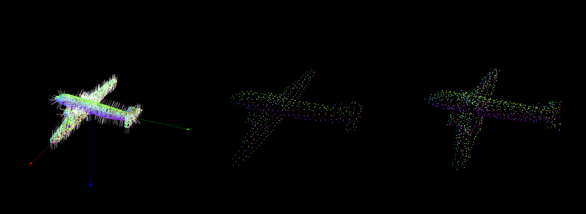
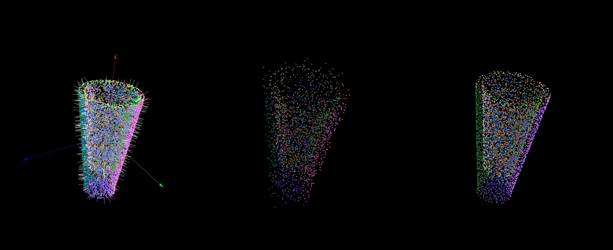
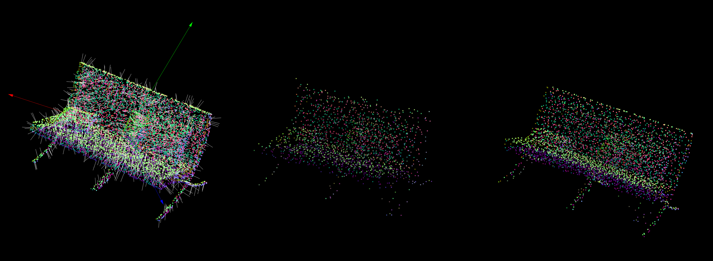

3D_PointCloud_Process/documentations/chapter_1.md
# Homework of Chapter 1
### How to run this code?
This code is based on ROS noetic on ubuntu 20.04. The homework completed by C++ and is tested by a node named "chapter_1" in package "small_projects".
1. Down load the whole workspace "3D_PointCloud_Processing".
2. Check or modify the source file /src/small_projects/src/chapter_1.cpp
3. Compile the package as follows.
   ```shell
   cd 3D_PointClud_Processing
   catkin_make
   ```
4. Run the chapter_1 node as follows, remember to replace the file path with your own ModelNet40 file path.
   ```shell
   source ./devel/setup.bash
   roscore
   # run below command in another terminal
   rosrun small_projects chapter_1 data/modelnet40_normal_resampled/airplane/airplane_0001.txt
   ```
### Result
aieplane_0004.txt

cup_0004.txt

sofa_0004.txt

### Key Code
#### API
All the algorithm is completed in a class named BasicAlgorithm defined in small_projects/include/chapter_1/basic_algorithm.h. The API of BasicAlgorithm refer to small_projects/src/chapter_1.cpp as follows.
```C++
// small_projects/src/chapter_1.cpp

// PCA
BasicAlgorithm basic_algorithm;
Eigen::Matrix3f matrix_u; // used to store the U matrix based on SVD of input x
basic_algorithm.setInputPointCloud(cloud);
basic_algorithm.execPCA();
basic_algorithm.getMatrixU(matrix_u);

// Estimate normals
pcl::PointCloud<pcl::Normal>::Ptr normals (new pcl::PointCloud<pcl::Normal>); // used to store the normal info 
float neighbourhood_radius = 0.1;
basic_algorithm.setOutputNormals(normals);
basic_algorithm.estimateNormal(neighbourhood_radius); 
basic_algorithm.getNormals(normals);
    
// Voxel grid downsample
pcl::PointCloud<pcl::PointXYZRGBA>::Ptr downsampled_cloud(new pcl::PointCloud<pcl::PointXYZRGBA>); // used to store the downsampled point cloud
float voxel_size = 0.05;
// basic_algorithm.voxelGridDownSample(0.05, "random"); // voxel grid downsampling based on random method
basic_algorithm.voxelGridDownSample(voxel_size, "centroid"); // voxel grid downsampling based on centroid method
basic_algorithm.getDownSampledCloud(downsampled_cloud);
```
#### PCA
Steps of PCA:
1. Normalized by center.
2. Compute SVD.
3. Take the vectors of matrix U as the pinciple vectors.
```C++
// small_projects/include/chapter_1/basic_algorithm.h

void execPCA()
{
   // normalization
   normalize();
   // svd based on Eigen
   Eigen::JacobiSVD<Eigen::MatrixXf> svd(normalized_x_, Eigen::ComputeThinU | Eigen::ComputeThinV);   
   // get the matrix u as the priciple components
   matrix_u_ = svd.matrixU();
}
// normalize the input cloud
void normalize()
{
   // calcualate the center
   centroid_ = Eigen::Vector3f::Zero();
   for (auto point : cloud_->points)
   {
      centroid_(0) += point.x;
      centroid_(1) += point.y;
      centroid_(2) += point.z;
   }
   centroid_(0) /= cloud_->points.size();
   centroid_(1) /= cloud_->points.size();
   centroid_(2) /= cloud_->points.size();
   // calculate the normalized x matrix
   normalized_x_.resize(3, cloud_->points.size());
        
   for (int point_index = 0; point_index < cloud_->points.size(); ++point_index)
   {
      normalized_x_(0, point_index) = cloud_->points.at(point_index).x - centroid_(0);
      normalized_x_(1, point_index) = cloud_->points.at(point_index).y - centroid_(1);
      normalized_x_(2, point_index) = cloud_->points.at(point_index).z - centroid_(2);
   }
}
```
#### Estimate Normals
Steps of estimate normals
1. For each point, find the neighbours.
2. PCA on neighbours.
3. Select the last principle vector as the normal vector.
```C++
// small_projects/include/chapter_1/basic_algorithm.h

void estimateNormal(float radius)
{
   std::vector<int> neighbours; // vector container, used to store the indexes of neighbours
   Eigen::MatrixXf normalized_x; // 3*X matrix，used to store the normalized neighbours
   for (int point_index = 0; point_index < cloud_->points.size(); ++point_index) 
   {
      findNeighbours(point_index, radius, neighbours); // find the neighbours of point_index, based on the radius
      normalize(neighbours, normalized_x); // calculate the normalized neighbours
            
      // svd & calculate the normal vector
      Eigen::JacobiSVD<Eigen::MatrixXf> svd(normalized_x, Eigen::ComputeThinU | Eigen::ComputeThinV);
      Eigen::Matrix3f matrix_u = svd.matrixU();
      Eigen::Vector3f normal_vector = matrix_u.col(2); // select the 3rd vector of matrix u as the normal vector
      normals_->points.at(point_index).normal_x = normal_vector(0);
      normals_->points.at(point_index).normal_y = normal_vector(1);
      normals_->points.at(point_index).normal_z = normal_vector(2);
   }
}

// find the neighbours of a center point, based on teh radius
void findNeighbours(int center_point_index, float radius, std::vector<int>& neighbours)
{
   neighbours.clear();
   float dist_squre; // the squre of Euclid Distance
   for (int point_index = 0; point_index < cloud_->points.size(); ++point_index)
   {
      dist_squre = std::pow((cloud_->points.at(point_index).x - cloud_->points.at(center_point_index).x), 2) + 
                         std::pow((cloud_->points.at(point_index).y - cloud_->points.at(center_point_index).y), 2) +
                         std::pow((cloud_->points.at(point_index).z - cloud_->points.at(center_point_index).z), 2);
      if (dist_squre <= radius*radius) // if Euclid Distance of a neighbour less than the radius
      {
         neighbours.push_back(point_index); // add the neighbour in the neighbours vector contatiner
      }
   }
}

// a overload of normalize function, used to normalized the points based on neighbours info
void normalize(const std::vector<int>& neighbours, Eigen::MatrixXf& normalized_x)
{
   // calcualate the centroid
   Eigen::Vector3f centroid = Eigen::Vector3f::Zero();
   for (int neighbour_index = 0; neighbour_index < neighbours.size(); ++neighbour_index)
   {
      centroid(0) += cloud_->points.at(neighbours.at(neighbour_index)).x;
      centroid(1) += cloud_->points.at(neighbours.at(neighbour_index)).y;
      centroid(2) += cloud_->points.at(neighbours.at(neighbour_index)).z;
   }
   centroid(0) /= neighbours.size();
   centroid(1) /= neighbours.size();
   centroid(2) /= neighbours.size();
        
   // calculate the normalized x matrix
   normalized_x.resize(3, neighbours.size());
   for (int neighbour_index = 0; neighbour_index < neighbours.size(); ++neighbour_index)
   {
      normalized_x(0, neighbour_index) = cloud_->points.at(neighbours.at(neighbour_index)).x - centroid(0);
      normalized_x(1, neighbour_index) = cloud_->points.at(neighbours.at(neighbour_index)).y - centroid(1);
      normalized_x(2, neighbour_index) = cloud_->points.at(neighbours.at(neighbour_index)).z - centroid(2);
   }
}
```
#### Voxel Grid DownSample
Steps of voxel grid downsample
1. Compute the min and max of the point cloud.
2. Compute the dimensions of the voxel grid.
3. Compute the voxel index of each point.
4. Sort the points based on the voxel index.
5. Generate one point (centroid or random) from a batch (points with same voxel index).
```C++
// small_projects/include/chapter_1/basic_algorithm.h

void voxelGridDownSample(float voxel_size, std::string method)
{
   // compute the max and min of the points
   Eigen::Vector3f min, max;
   getMinMax(min, max);
   // calculate the dimensions of each voxel
   int dx = ceil((max(0) - min(0))/voxel_size);
   int dy = ceil((max(1) - min(1))/voxel_size);
   // compute the voxel index for each point
   std::vector<index_st> index_vector(cloud_->size()); // each element stores the index of both voxel and point cloud
   for (int point_index = 0; point_index < cloud_->size(); ++point_index)
   {
      index_vector.at(point_index).voxel_index = getVoxelIndex(cloud_->points.at(point_index), min, voxel_size, dx, dy); // update the voxel index
      index_vector.at(point_index).point_index = point_index; // update the point cloud index
   }
   // sort the vector based on the voxel index
   td::sort(index_vector.begin(), index_vector.end(), less_based_on_voxel_index);
   // select a point from points with same voxel index
   int begin_position = 0; // the first position of a batch (points with same index)
   int end_position; // the last position of a batch (points with same index)
   index_st dumy_index; 
   dumy_index.point_index = -1;
   dumy_index.voxel_index = -1;
   index_vector.push_back(dumy_index); // add a dumy_index at the end of vector, in order to walk through all the elements
   for (int vector_index = 0; vector_index < index_vector.size() - 1; ++vector_index)
   {
      if (index_vector.at(vector_index).voxel_index != index_vector.at(vector_index + 1).voxel_index) // if the voxel index of current element is different with that of next element
      {
         end_position = vector_index; 
         pcl::PointXYZRGBA downsampled_point;
         // generate a point from a batch (points with same voxel index) based on the input method
         getPointFromBatch(downsampled_point, method, index_vector, begin_position, end_position);
         downsampled_cloud_->push_back(downsampled_point);
         begin_position = vector_index + 1;
      }
   }
}

// struct index_st is used to store the index of both voxel and point info
struct index_st 
{
    int voxel_index;
    int point_index;
};

// function less_based_on_voxel_index is used as the input of std::sort
bool less_based_on_voxel_index(index_st a, index_st b) 
{   
    return a.voxel_index < b.voxel_index; 
}

// calculate the min and max points for the cloud_
void getMinMax(Eigen::Vector3f& min, Eigen::Vector3f& max)
{
   min(0) = max(0) = cloud_->points.at(0).x;
   min(1) = max(1) = cloud_->points.at(0).y;
   min(2) = max(2) = cloud_->points.at(0).z;
   for (auto point : cloud_->points)
   {
      min(0) = std::min(min(0), point.x);
      min(1) = std::min(min(1), point.y);
      min(2) = std::min(min(2), point.z);
      max(0) = std::max(max(0), point.x);
      max(1) = std::max(max(1), point.y);
      max(2) = std::max(max(2), point.z);
   }
}

// calculate the voxel index of each point
int getVoxelIndex(const pcl::PointXYZRGBA& point, const Eigen::Vector3f& min, const float voxel_size, const int dx, const int dy)
{
   int hx = floor((point.x - min(0))/voxel_size);
   int hy = floor((point.y - min(1))/voxel_size);
   int hz = floor((point.z - min(2))/voxel_size);
   int h = hx + hy * dx + hz * dx * dy;
   return h;
}

// generate a point from a batch (points with same voxel index), based on the input method
void getPointFromBatch(pcl::PointXYZRGBA& downsampled_point, std::string& method, std::vector<index_st>& index_vector, int begin_position, int end_position)
{
   if (method == "centroid")
   {
      float x = 0;
      float y = 0;
      float z = 0;
      uint16_t r = 0;
      uint16_t g = 0;
      uint16_t b = 0;
      for (int position = begin_position; position < end_position; ++position)
      {
         x += cloud_->points.at(index_vector.at(position).point_index).x;
         y += cloud_->points.at(index_vector.at(position).point_index).y;
         z += cloud_->points.at(index_vector.at(position).point_index).z;
         r += cloud_->points.at(index_vector.at(position).point_index).r;
         g += cloud_->points.at(index_vector.at(position).point_index).g;
         b += cloud_->points.at(index_vector.at(position).point_index).b;
      }
      // the centroid of batch (points with same voxel index)
      x /= (end_position - begin_position + 1);
      y /= (end_position - begin_position + 1);
      z /= (end_position - begin_position + 1);
      // calculate the average of color as the new color of centroid point
      r = static_cast<uint8_t>(r/(end_position - begin_position + 1));
      g = static_cast<uint8_t>(g/(end_position - begin_position + 1));
      b = static_cast<uint8_t>(b/(end_position - begin_position + 1));
      downsampled_point.x = x;
      downsampled_point.y = y;
      downsampled_point.z = z;
      downsampled_point.r = r;
      downsampled_point.g = g;
      downsampled_point.b = b;
   }
   else if (method == "random")
   {
      int rand_index = (std::rand() % (end_position - begin_position +1 ))+ begin_position; // generate an int random number between begin positon and end position
      downsampled_point = cloud_->points.at(index_vector.at(rand_index).point_index);
   }
   else
   {
      std::cerr << "The voxel grid downsample method is invalid" << std::endl;
   }
}
```