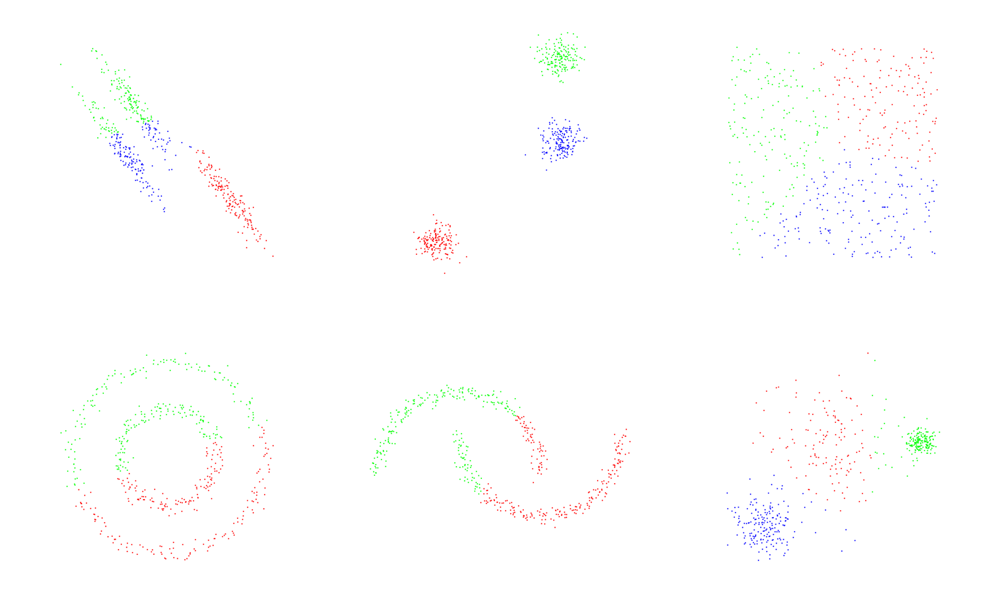
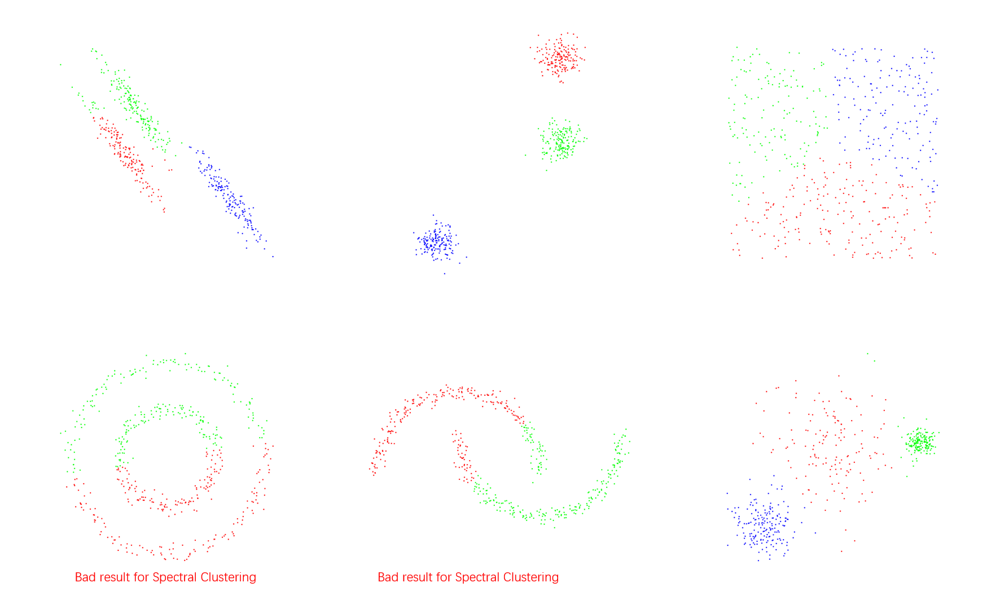
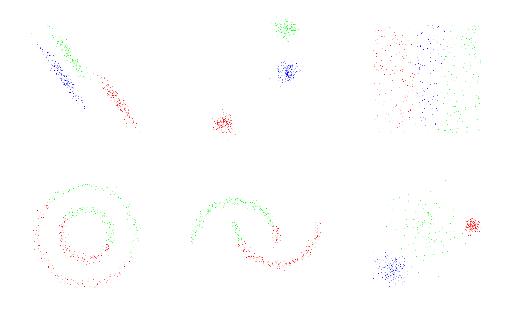

# Homework of Chapter 3

考虑到 pcl 库本身并没有各种各样的聚类功能，因此打算用 C++ 来完成本章作业。
完成了 KMeans, GMM 和 Spectral Clustering，但是 Spectral Clustering 的效果并不好，希望老师能帮忙看一下问题出在哪里。

### How to run this code?
This code is based on ROS noetic on ubuntu 20.04. The homework completed by C++ and is tested by a node named "chapter_3" in package "small_projects".
1. Down load the whole workspace "3d_point_cloud_processing".
2. Check or modify the source file /src/small_projects/src/chapter_3.cpp
3. Compile the package as follows.
   ```shell
   cd 3d_point_cloud_processing
   catkin_make
   ```
4. Run the chapter_3 node as follows.
   ```shell
   source ./devel/setup.bash
   roscore
   # run below command in another terminal
   rosrun small_projects chapter_3 data/cluster_data/varied.pcd GMM 3 
   # data/cluster_data/varied.pcd is the input point cloud file
   # GMM is the cluster method, you can also using KMeans or Spectral_Clustrering
   # 3 is the cluster number, you can input other int number
   ```


### 文件转换
根据作业要求，需要用 scipy 库来生成原始数据，因此编写了一个 python 脚本 (src/sript/generate_cluster_input.py) 用来生成 原始数据，转换为 open3d 的点云数据并保存为 pcd 文件，保存路径为 data/cluster_data。  
由于生成的是点是二维平面上的点，考虑到通用性，保存的 pcd 文件为三维点云，其中 z 轴的坐标值取 0。
### API
有了 pcd 文件，就可以直接直接使用 pcl 库读取。  
在本次作业中，将聚类算法写成了一个类，名为 ClusterAlgorithm，类中设置了一些成员函数用来给其传入聚类所用的方法，点云，迭代次数等。聚类的结果存入一个 vector 容器中(cluster_indeces)，其容器的大小与簇的个数相同，每个元素分别存储着每个簇中含有的点云的 index。
```C++
// src/small_projects/src/chapter_1.cpp
// read the pcd file
pcl::PointCloud<pcl::PointXYZRGBA>::Ptr cloud(new pcl::PointCloud<pcl::PointXYZRGBA>);
pcl::io::loadPCDFile<pcl::PointXYZRGBA> ("data/cluster_data/noisy_moons.pcd", *cloud);

// cluster
ClusterAlgorithm cluster;
boost::shared_ptr<std::vector<pcl::PointIndices>> cluster_indeces(new std::vector<pcl::PointIndices>);
int cluster_num = 2;
int max_iterations = 5;
cluster.setInputPointCloud(cloud);
cluster.setClusterMethod("KMeans");
cluster.setClusterNumber(cluster_num);
cluster.setMaxIterations(max_iterations);
cluster.execCluster();
cluster.getClusterResult(cluster_indeces);
```
### KMeans
#### 算法效果
算法效果与scipy的结果类似，如下所示。

#### 算法概述
除了老师的课件以外， KMeans 算法也可以参考《机器学习》P202。  
KMeans 算法主要包括 E step 和 M step，两者交替进行，不断更新每个簇的中心位置。
E step 主要是根据已知的几个簇的中心点的位置，遍历每个点，计算每个店与当前簇的中心点的距离，并选择最小距离的簇作为该点的簇。
M step 主要是根据每个簇所拥有的点的坐标，通过计算平均值的方式生成一个新的簇的中心点，作为更新后的簇的中心点。  
#### 代码
ClusterAlgorithm 的成员函数 execCluster() 实际上根据输入的方法不同，调用不同的代码。实际上最终执行 KMeans 算法的是函数 cluster_KMeans_vectors(), 这个函数以 std::vector<Eigen::VectorXf> 为输入参数而不是点云数据，为的是该函数可以被 Spectral Clustering 复用。  
要想使用函数 cluster_KMeans_vectors() ，需要先将点云转化为 std::vector<Eigen::VectorXf>，如下所示：
```C++
// src/small_projects/include/chaper_3/cluster_algorithm.h
    void execCluster()
    {
        if (cluster_method_ == "KMeans")
        {
            std::vector<Eigen::VectorXf> km_vectors;
            Eigen::VectorXf temp_vector3f;
            temp_vector3f.resize(3);
            for (int point_index = 0; point_index < cloud_->size(); ++point_index)
            {
                temp_vector3f(0) = cloud_->points.at(point_index).x;
                temp_vector3f(1) = cloud_->points.at(point_index).y;
                temp_vector3f(2) = cloud_->points.at(point_index).z;
                km_vectors.push_back(temp_vector3f); // calculate km_vectors
            }
            cluster_KMeans_vectors(km_vectors); // KMeans algorithm on km_vectors
        }
        else if (cluster_method_ == "GMM")
        {
            cluster_GMM();
        }
        else if (cluster_method_ == "Spectral_Clustering")
        {
            std::vector<Eigen::VectorXf> km_vectors;
            calculate_KM_input(km_vectors); // calculate km_vectors
            cluster_KMeans_vectors(km_vectors); // KMeans algorithm on km_vectors
        }
        else
        {
            std::cout << "Input method is invalid!" << std::endl;
        }
    }
```
比较长的函数的实现，放在了同名的 hpp 文件中，cluster_KMeans() 的具体实现如下：  
简而言之，首先随机几个点作为初始点，然后进入循环，执行 E Step，E Step 主要是更新每个点的所属簇的标签 cluster_labels。执行完 E Step 后，执行 M Step，M Step 主要是更新每个簇的中心 cluster_centroid。
```C++
// src/small_projects/include/chaper_3/cluster_algorithm.hpp
void ClusterAlgorithm::cluster_KMeans_vectors(std::vector<Eigen::VectorXf>& km_vectors)
{
    srand(time(0));
    int dim = km_vectors.at(0).size();
    // random select K (cluster_num) points as the intial position of clusters 
    std::vector<Eigen::VectorXf> cluster_centroid;
    Eigen::VectorXf temp_vector;
    int rand_index;
    for (int cluster_index = 0; cluster_index < cluster_num_; ++cluster_index)
    {
        rand_index = std::rand() % km_vectors.size();
        temp_vector = km_vectors.at(rand_index);
        cluster_centroid.push_back(temp_vector);
    }
    // interation loop
    std::vector<int> cluster_labels(km_vectors.size(), -1);
    std::vector<float> distance(cluster_num_, -1.0); // For one point, the distance btw the point and the cluster_centroid
    int iteration = 0;
    while (iteration < max_iterations_)
    {
        // E step: calculate which cluster does each point belong to
        for (int point_index = 0; point_index < km_vectors.size(); ++point_index)
        {
            for (int cluster_index = 0; cluster_index < cluster_num_; ++cluster_index)
            {
                Eigen::VectorXf diff = cluster_centroid.at(cluster_index) - km_vectors.at(point_index);
                distance.at(cluster_index) = diff.norm();
            }
            cluster_labels.at(point_index) = (min_element(distance.begin(), distance.end())) - distance.begin(); // the cluster which has the minium distance with point
        }
        // M step: update the centroid of each cluster
        std::vector<Eigen::VectorXf> cluster_centroid_sum(cluster_num_);
        for (int cluster_index = 0; cluster_index < cluster_num_; ++cluster_index)
        {
            cluster_centroid_sum.at(cluster_index).resize(dim);
            cluster_centroid_sum.at(cluster_index).setZero();
        }
        std::vector<int> cluster_sum_num(cluster_num_, 0);
        for (int point_index = 0; point_index < km_vectors.size(); ++point_index)
        {
            int cluster_index = cluster_labels.at(point_index);
            cluster_centroid_sum.at(cluster_index) += km_vectors.at(point_index); 
            cluster_sum_num.at(cluster_index) += 1; // add 1 at the corresponding cluster
        }
        for (int cluster_index = 0; cluster_index < cluster_num_; ++cluster_index)
        {
            cluster_centroid.at(cluster_index) = cluster_centroid_sum.at(cluster_index) / cluster_sum_num.at(cluster_index);
        }
        ++iteration;
    }

    // store the cluster result
    ClusterAlgorithm::cluster_indices_->resize(cluster_num_);
    for (int point_index = 0; point_index < km_vectors.size(); ++point_index)
    {
        int cluster_index = cluster_labels.at(point_index);
        ClusterAlgorithm::cluster_indices_->at(cluster_index).indices.push_back(point_index);
    }
}
```
### Spectral Clustring
#### 算法效果
算法效果不太理想，与scipy上的结果有所不同，具体哪里有问题有待查证。

#### 算法概述
谱聚类的算法流程如下：
1. 通过两个点之间的相似度，计算出相似度矩阵 W 矩阵；
2. W 矩阵每行去和，存入对角位置，记为 D 矩阵；
3. 计算 L 矩阵，L = D - W;
4. 计算 L 矩阵的特征值和特征向量， 取最小的 k 个特征值对应的调整向量，拼接成矩阵 V;
5. 取矩阵 V 的每一行，为一个 k 维的向量，共计 n 个 k 维的向量；
6. 使用 KMeans 对 n 个 k 维的向量进行聚类。
#### 代码
最后的 KMeans 对 n 个 k 维的向量进行聚类是复用 KMeans 的函数，不再赘述。这里主要介绍函数 calculate_KM_input()，即如何计算出 n 个 k 维的向量，重点如下：
1. 使用高斯函数计算相似度
2. 使用 Eigen 库求 L 矩阵的特征值和特征向量, 特征向量并不是严格按照特征值从小到大排列，因此需要对特征向量进行排序。 本例中使用结构体 EigenValueAndVector 将特征值和特征向量绑定，又定义了一个函数 less_based_on_eigenvalue() ，该函数基于绑定的特征值来比较两个结构体 EigenValueAndVector 的大小，最后使用 STL 的函数 sort() 来进行排序，整个排序算法封装为一个私有的成员函数 sortEigenvectorsByEigenvalues ，如下：
```C++
// src/small_projects/include/chaper_3/cluster_algorithm.hpp
struct EigenValueAndVector
{
    float eigenvalue;
    Eigen::VectorXf eigenvector;
};

bool less_based_on_eigenvalue(EigenValueAndVector a, EigenValueAndVector b) 
{   
    return a.eigenvalue < b.eigenvalue; 
}

void ClusterAlgorithm::sortEigenvectorsByEigenvalues(Eigen::MatrixXf& eigenvalues, Eigen::MatrixXf& eigenvectors)
{
    std::vector<EigenValueAndVector> eigenvalue_and_vectors;
    int size = eigenvalues.col(0).size();
    EigenValueAndVector temp_eigenvalue_and_vector;
    for (int index = 0; index < size; ++index)
    {
        temp_eigenvalue_and_vector.eigenvalue = eigenvalues(index, index);
        temp_eigenvalue_and_vector.eigenvector = eigenvectors.col(index);
        eigenvalue_and_vectors.push_back(temp_eigenvalue_and_vector);
    }
    std::sort(eigenvalue_and_vectors.begin(), eigenvalue_and_vectors.end(), less_based_on_eigenvalue);
    
    for (int index = 0; index < eigenvalue_and_vectors.size(); ++index)
    {
        eigenvalues(index, index) = eigenvalue_and_vectors.at(index).eigenvalue;
        eigenvectors.col(index) = eigenvalue_and_vectors.at(index).eigenvector / eigenvalue_and_vectors.at(index).eigenvector.norm();
    }
}
```
3. 计算各个矩阵，计算特征值和特征向量主要是依赖 Eigen 库，函数 calculate_KM_input() 如下：
```C++
// src/small_projects/include/chaper_3/cluster_algorithm.hpp
void ClusterAlgorithm::cluster_KMeans_vectors(std::vector<Eigen::VectorXf>& km_vectors)
{
    srand(time(0));
    int dim = km_vectors.at(0).size();
    // random select K (cluster_num) points as the intial position of clusters 
    std::vector<Eigen::VectorXf> cluster_centroid;
    Eigen::VectorXf temp_vector;
    int rand_index;
    for (int cluster_index = 0; cluster_index < cluster_num_; ++cluster_index)
    {
        rand_index = std::rand() % km_vectors.size();
        temp_vector = km_vectors.at(rand_index);
        cluster_centroid.push_back(temp_vector);
    }
    // interation loop
    std::vector<int> cluster_labels(km_vectors.size(), -1);
    std::vector<float> distance(cluster_num_, -1.0); // For one point, the distance btw the point and the cluster_centroid
    int iteration = 0;
    while (iteration < max_iterations_)
    {
        // E step: calculate which cluster does each point belong to
        for (int point_index = 0; point_index < km_vectors.size(); ++point_index)
        {
            for (int cluster_index = 0; cluster_index < cluster_num_; ++cluster_index)
            {
                Eigen::VectorXf diff = cluster_centroid.at(cluster_index) - km_vectors.at(point_index);
                distance.at(cluster_index) = diff.norm();
            }
            cluster_labels.at(point_index) = (min_element(distance.begin(), distance.end())) - distance.begin(); // the cluster which has the minium distance with point
        }
        // M step: update the centroid of each cluster
        std::vector<Eigen::VectorXf> cluster_centroid_sum(cluster_num_);
        for (int cluster_index = 0; cluster_index < cluster_num_; ++cluster_index)
        {
            cluster_centroid_sum.at(cluster_index).resize(dim);
            cluster_centroid_sum.at(cluster_index).setZero();
        }
        std::vector<int> cluster_sum_num(cluster_num_, 0);
        for (int point_index = 0; point_index < km_vectors.size(); ++point_index)
        {
            int cluster_index = cluster_labels.at(point_index);
            cluster_centroid_sum.at(cluster_index) += km_vectors.at(point_index); 
            cluster_sum_num.at(cluster_index) += 1; // add 1 at the corresponding cluster
        }
        for (int cluster_index = 0; cluster_index < cluster_num_; ++cluster_index)
        {
            cluster_centroid.at(cluster_index) = cluster_centroid_sum.at(cluster_index) / cluster_sum_num.at(cluster_index);
        }
        ++iteration;
    }

    // store the cluster result
    ClusterAlgorithm::cluster_indices_->resize(cluster_num_);
    for (int point_index = 0; point_index < km_vectors.size(); ++point_index)
    {
        int cluster_index = cluster_labels.at(point_index);
        ClusterAlgorithm::cluster_indices_->at(cluster_index).indices.push_back(point_index);
    }
}
```
### GMM
#### 算法效果
算法效果与scipy的结果相同，如下所示。

#### 算法概述
除了老师的课件以外， KMeans 算法也可以参考《机器学习》P210。  
KMeans 算法主要包括 E step 和 M step，两者交替进行。
E step 主要是根据已知的高斯混合模型，以及点的具体坐标的前提下，计算各混合成分生成的后验概率。遍历每个点，选择后验概率最高的成分作为每个点的簇。
M step 主要是根据每个点的坐标，以及各混合成分的后验概率，来更新高斯混合模型的参数，包括均值，协方差，以及混合权重。 
#### 代码
一些参数在代码中的变量如下所示：  
alphas：高斯混合模型各个分量的权重    
mus：高斯很合模型各个分量的均值  
sigmas：高斯很合模型各个分量的均值  
gammas：给定样品在各个分量下的后验概率  
```C++
// src/small_projects/include/chaper_3/cluster_algorithm.hpp
void ClusterAlgorithm::cluster_GMM()
{
    srand(time(0));
    int dim = 3;

    // use 1/cluster_num as the weight of each gaussian distribution
    std::vector<float> alphas(cluster_num_, 1/static_cast<float>(cluster_num_));
    // random select cluster_num points as initial mus
    std::vector<Eigen::Vector3f> mus; 
    Eigen::Vector3f temp_point;
    int rand_index;
    for (int cluster_index = 0; cluster_index < cluster_num_; ++cluster_index)
    {
        rand_index = std::rand() % cloud_->size();
        temp_point(0) = cloud_->points.at(rand_index).x;
        temp_point(1) = cloud_->points.at(rand_index).y;
        temp_point(2) = cloud_->points.at(rand_index).z;
        mus.push_back(temp_point); // initial mus complete
    }
    // use matrix I as the cov matrix of each gaussian distribution
    std::vector<Eigen::Matrix3f> sigmas(cluster_num_, Eigen::Matrix3f::Identity());

    // interation loop
    std::vector<Eigen::VectorXf> gammas(cloud_->size()); 
    int iteration = 0;
    while (iteration < max_iterations_)
    {
        // E step: Refer to 《机器学习》P210
        for (int point_index = 0; point_index < cloud_->size(); ++point_index)
        {
            // for each points, calculate posteriors of gaussian distribution
            Eigen::Vector3f temp_point(cloud_->points.at(point_index).x, cloud_->points.at(point_index).y, cloud_->points.at(point_index).z);
            gammas.at(point_index).resize(cluster_num_);
            // calculate the denominator firstly
            float temp_denominator = 0;
            for (int cluster_index = 0; cluster_index <cluster_num_; ++cluster_index)
            {
                temp_denominator += alphas.at(cluster_index) * gaussian_distribution(temp_point, mus.at(cluster_index),sigmas.at(cluster_index));
            }
            // calculate the numerators and posteriors of gaussian distribution
            float temp_numerator;
            for (int cluster_index = 0; cluster_index < cluster_num_; ++cluster_index)
            {
                temp_numerator = alphas.at(cluster_index) * gaussian_distribution(temp_point, mus.at(cluster_index),sigmas.at(cluster_index));
                gammas.at(point_index)(cluster_index) = temp_numerator / temp_denominator;
            }
        }

        // M step: Refer to 《机器学习》P210
        std::vector<float> effective_num(cluster_num_, 0);
        for (int point_index = 0; point_index < cloud_->size(); ++point_index)
        {
            for (int cluster_index = 0; cluster_index < cluster_num_; ++cluster_index)
            {
                effective_num.at(cluster_index) += gammas.at(point_index)(cluster_index);
            }
        }
        std::vector<Eigen::Vector3f> temp_mus_numerator(cluster_num_, Eigen::Vector3f::Zero());
        std::vector<Eigen::Matrix3f> temp_sigmas_numerator(cluster_num_, Eigen::Matrix3f::Zero());
        for (int cluster_index = 0; cluster_index < cluster_num_; ++cluster_index)
        {
            // update the mus
            for (int point_index = 0; point_index < cloud_->size(); ++point_index)
            {
                Eigen::Vector3f temp_point(cloud_->points.at(point_index).x, cloud_->points.at(point_index).y, cloud_->points.at(point_index).z);
                temp_mus_numerator.at(cluster_index) += gammas.at(point_index)(cluster_index) * temp_point;
            }
            mus.at(cluster_index) = temp_mus_numerator.at(cluster_index) / effective_num.at(cluster_index);
            // update the sigmas
            for (int point_index = 0; point_index < cloud_->size(); ++point_index)
            {
                Eigen::Vector3f temp_point(cloud_->points.at(point_index).x, cloud_->points.at(point_index).y, cloud_->points.at(point_index).z);
                temp_sigmas_numerator.at(cluster_index) += gammas.at(point_index)(cluster_index) * (temp_point - mus.at(cluster_index)) * (temp_point - mus.at(cluster_index)).transpose();
            }
            sigmas.at(cluster_index) = temp_sigmas_numerator.at(cluster_index) / effective_num.at(cluster_index);

            // below code is used to avoid sigularity
            for (int dim_index = 0; dim_index < dim; ++dim_index)
            {
                if (sigmas.at(cluster_index)(dim_index, dim_index) < 0.01)
                    sigmas.at(cluster_index)(dim_index, dim_index) = 0.01;
            }
            // update the alphas
            alphas.at(cluster_index) = effective_num.at(cluster_index) / cloud_->size();
        }
        ++iteration;
    }

    // store the cluster result
    ClusterAlgorithm::cluster_indices_->resize(cluster_num_);
    Eigen::VectorXf::Index cluster_label;
    for (int point_index = 0; point_index < cloud_->size(); ++point_index)
    {
        //int cluster_label;
        gammas.at(point_index).maxCoeff(&cluster_label);
        ClusterAlgorithm::cluster_indices_->at(cluster_label).indices.push_back(point_index);
    }
} 

float ClusterAlgorithm::gaussian_distribution(Eigen::Vector3f x, Eigen::Vector3f mu, Eigen::Matrix3f sigma)
{
    return 1 / std::sqrt(std::pow(2 * PI, x.size()) * sigma.determinant()) * std::exp(-0.5 * (x - mu).transpose() * sigma.inverse() * (x - mu));
}
```
