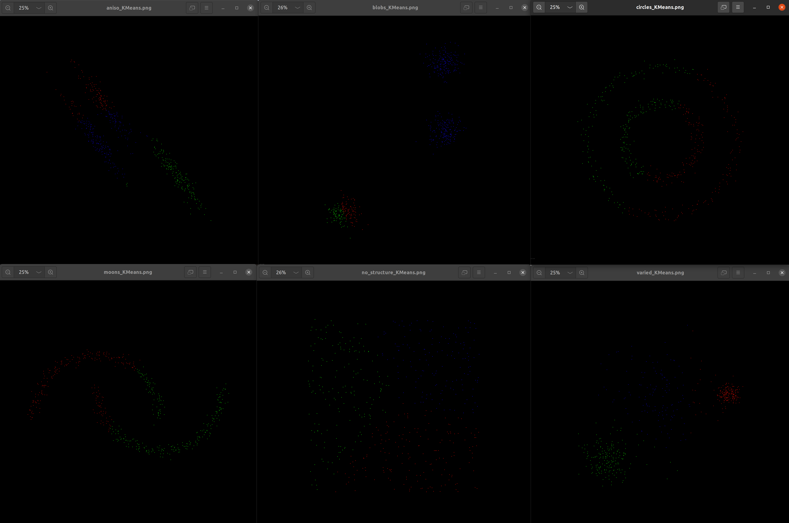

# Homework of Chapter 3

考虑到 pcl 库本身并没有各种各样的聚类功能，因此打算用 C++ 来完成本章作业。
由于使劲紧迫，暂时只完成了 KMeans 的代码编写工作，其余聚类算法的代码会稍后更新。

### 文件转换
根据作业要求，需要用 scipy 库来生成原始数据，因此编写了一个 python 脚本 (src/sript/generate_cluster_input.py) 用来生成 原始数据，转换为 open3d 的点云数据并保存为 pcd 文件，保存路径为 data/cluster_data。  
由于生成的是点是二维平面上的点，考虑到通用性，保存的 pcd 文件为三维点云，其中 z 轴的坐标值取 0。
### API
有了 pcd 文件，就可以直接直接使用 pcl 库读取。  
在本次作业中，将聚类算法写成了一个类，名为 ClusterAlgorithm，类中设置了一些成员函数用来给其传入聚类所用的方法，点云，迭代次数等。聚类的结果存入一个 vector 容器中，vector的大小与簇的个数相同，每个元素分别存储着每个簇中含有的点云的 index。
```C++
// src/small_projects/src/chapter_1.cpp
// read the pcd file
pcl::PointCloud<pcl::PointXYZRGBA>::Ptr cloud(new pcl::PointCloud<pcl::PointXYZRGBA>);
pcl::io::loadPCDFile<pcl::PointXYZRGBA> ("data/cluster_data/noisy_moons.pcd", *cloud);

// cluster
ClusterAlgorithm cluster;
boost::shared_ptr<std::vector<pcl::PointIndices>> cluster_indeces(new std::vector<pcl::PointIndices>);
int cluster_num = 2;
int max_iterations = 5;
cluster.setInputPointCloud(cloud);
cluster.setClusterMethod("KMeans");
cluster.setClusterNumber(cluster_num);
cluster.setMaxIterations(max_iterations);
cluster.execCluster();
cluster.getClusterResult(cluster_indeces);
```
### KMeans
#### 算法概述
除了老师的课件以外， KMeans 算法也可以参考《机器学习》P202。  
KMeans 算法主要包括 E step 和 M step，两者交替进行，不断更新每个簇的中心位置。
E step 主要是根据已知的几个簇的中心点的位置，遍历每个点，计算每个店与当前簇的中心点的距离，并选择最小距离的簇作为该点的簇。
M step 主要是根据每个簇所拥有的点的坐标，通过计算平均值的方式生成一个新的簇的中心点，作为更新后的簇的中心点。  
#### 代码
ClusterAlgorithm 的成员函数 execCluster() 实际上只是封装了三个单独的函数，如下：
```C++
// src/small_projects/include/chaper_3/cluster_algorithm.h
void execCluster()
{
    if (cluster_method_ == "KMeans")
        cluster_KMeans();
    else if (cluster_method_ == "GMM")
        cluster_GMM();
    else if (cluster_method_ == "Spectral_Clustering")
        cluster_spectral_clustring();
}
```
比较长的函数的实现，放在了同名的 hpp 文件中，cluster_KMeans() 的具体实现如下:
```C++
void ClusterAlgorithm::cluster_KMeans()
{
    pcl::PointCloud<pcl::PointXYZRGBA>::Ptr cloud = ClusterAlgorithm::cloud_;
    int cluster_num = ClusterAlgorithm::cluster_num_;
    int max_iterations = ClusterAlgorithm::max_iterations_;
    int size = cloud_->size();
    int dim = 3;

    // random select K (cluster_num) points as the intial position of clusters 
    std::vector<Eigen::Vector3f> cluster_centroid;
    Eigen::Vector3f temp_point;
    int rand_index;
    for (int cluster_index = 0; cluster_index < cluster_num; ++cluster_index)
    {
        rand_index = std::rand() % size;
        temp_point(0) = cloud->points.at(rand_index).x;
        temp_point(1) = cloud->points.at(rand_index).y;
        temp_point(2) = cloud->points.at(rand_index).z;
        cluster_centroid.push_back(temp_point);
    }
    
    // interation loop
    std::vector<int> cluster_indexes(size, -1);
    std::vector<float> distance(cluster_num, -1.0); // For one point, the distance btw the point and the cluster_centroid
    int iteration = 0;
    while (iteration < max_iterations)
    {
        // E step: calculate which cluster does each point belong to
        for (int point_index = 0; point_index < size; ++point_index)
        {
            for (int cluster_index = 0; cluster_index < cluster_num; ++cluster_index)
            {
                float x_diff = cluster_centroid.at(cluster_index)(0) - cloud->points.at(point_index).x;
                float y_diff = cluster_centroid.at(cluster_index)(1) - cloud->points.at(point_index).y;
                float z_diff = cluster_centroid.at(cluster_index)(2) - cloud->points.at(point_index).z;
                distance.at(cluster_index) = sqrt(x_diff * x_diff + y_diff * y_diff + z_diff * z_diff);
            }
            cluster_indexes.at(point_index) = (min_element(distance.begin(), distance.end())) - distance.begin(); // the cluster which has the minium distance with point
        }

        // M step: update the centroid of each cluster
        std::vector<Eigen::Vector3f> cluster_centroid_sum(cluster_num, Eigen::Vector3f::Zero());
        std::vector<int> cluster_sum_num(cluster_num, 0);
        for (int point_index = 0; point_index < size; ++point_index)
        {
            int cluster_index = cluster_indexes.at(point_index);
            cluster_centroid_sum.at(cluster_index)(0) += cloud->points.at(point_index).x; 
            cluster_centroid_sum.at(cluster_index)(1) += cloud->points.at(point_index).y;
            cluster_centroid_sum.at(cluster_index)(2) += cloud->points.at(point_index).z;
            cluster_sum_num.at(cluster_index) += 1; // add 1 at the corresponding cluster
        }

        for (int cluster_index = 0; cluster_index < cluster_num; ++cluster_index)
        {
            cluster_centroid.at(cluster_index)(0) = cluster_centroid_sum.at(cluster_index)(0) / cluster_sum_num.at(cluster_index);
            cluster_centroid.at(cluster_index)(1) = cluster_centroid_sum.at(cluster_index)(1) / cluster_sum_num.at(cluster_index);
            cluster_centroid.at(cluster_index)(2) = cluster_centroid_sum.at(cluster_index)(2) / cluster_sum_num.at(cluster_index);
        }

        ++iteration;
    }

    // store the cluster result
    ClusterAlgorithm::cluster_indices_->resize(cluster_num);
    for (int point_index = 0; point_index < size; ++point_index)
    {
        int cluster_index = cluster_indexes.at(point_index);
        ClusterAlgorithm::cluster_indices_->at(cluster_index).indices.push_back(point_index);
    }
} 
```
#### 结果
KMeans 结果如下图所示，其中 blobs 的结果与标准答案不一致，怀疑是随机数生成的不好导致。 其余结果均与标准答案吻合。
