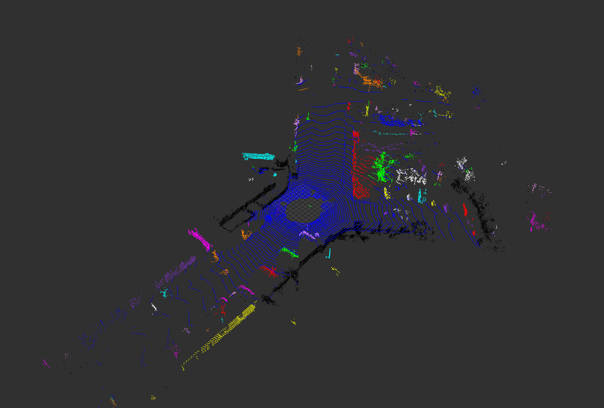

# Homework of Chapter 4

### How to run this code?
This code is based on ROS noetic on ubuntu 20.04. The homework completed by C++ and is tested by a launch file "quick_start" in package "small_projects".
1. Down load the whole workspace "3d_point_cloud_processing".
2. Compile the package as follows.
   ```shell
   cd 3d_point_cloud_processing
   catkin_make
   ```
3. Run the launch file as follows.
   ```shell
   source ./devel/setup.bash
   roslaunch big_project quick_start.launch
   ```

### 作业概述
本次作业，我用 C++ 写了三个节点，分别用来发布点云数据，地面点云去除，以及聚类，节点之间的关系如下图所示。

1. 实际上第一个节点，velodyne_publisher 还使用了第一章的 voxel grid 降采样算法，用来减少点云密度，缩短点云处理时间。  
2. 第二个节点， ground_removal 实际上发布了两个点云话题，分别是objects_w/o_cluster 以及 ground。
3. 最终 rviz 可视化的分别是话题 ground 以及第三个节点 clustering 的输出话题 objects_with_cluster。
### 作业结果
最终结果如下图哦所示，地面点云颜色为蓝色，其余点云使用不同颜色表示不同的簇。

### 基于 RANSAC 的地面去除
具体的作业实现，是写了一个 ModelFitAlgorithem 类，这个类用来给点云数据拟合模型。本次作业中，仅实现了平面模型，以及 RANSAC 的方法。API 如下所示
```C++
// src/big_project/src/ground_removal.cpp
#include "chapter_4/model_fit_algorithm.h"

ModelFitAlgorithem model_fit;
ModelParameters model_paras;
model_fit.setFitMethod("RANSAC");
model_fit.setInlierThreshod(0.15);
model_fit.setMaxIteration(100);
model_fit.setInputModelParameters(model_paras);
model_fit.setInputModel("plane");
pcl::PointIndices::Ptr inliers(new pcl::PointIndices);
pcl::PointIndices::Ptr outliers(new pcl::PointIndices);
model_fit.setInputPointCloud(input_cloud); // put in the point cloud
model_fit.execFit();
model_fit.getInliers(inliers);
model_fit.getOutliers(outliers);
```
具体的实现代码如下所示
```C++
// src/big_project/include/chapter_4/model_fit_algorithm.h
struct ModelParameters
{
    float para_1 = 0; // a for plane model ax + by + cz + 1 = 0
    float para_2 = 0; // b for plane model ax + by + cz + 1 = 0
    float para_3 = 0; // c for plane model ax + by + cz + 1 = 0
};

class ModelFitAlgorithem
{
public:
    ModelFitAlgorithem() = default;
    ~ModelFitAlgorithem() = default;

    void setInputPointCloud(pcl::PointCloud<pcl::PointXYZRGBA>::Ptr cloud)
    {   cloud_ = cloud; }

    void setInputModelParameters(ModelParameters& model_paras)
    {   model_paras_ = model_paras; }
    
    void setInputModel(std::string model_name) // "plane"
    {   model_name_ = model_name;   }

    void setMaxIteration(int max_iteration)
    {   max_iteration_ = max_iteration; }

    void setFitMethod(std::string method) // "RANSAC"
    {   method_ = method; }

    void setInlierThreshod(float threshold)
    {
        threshold_ = threshold;
    }

    void execFit()
    {
        if (method_ == "RANSAC")
        {
            ransacFit();
        }
    }

    void getInliers(pcl::PointIndices::Ptr& inliers)
    {  inliers = inliers_; }

    void getOutliers(pcl::PointIndices::Ptr& outliers)
    {  outliers = outliers_; }

private:
    float calculateDistance(pcl::PointXYZRGBA& point, ModelParameters& model_paras)
    {
        float d = 0;
        if (model_name_ == "plane")
        {
            float a = model_paras.para_1;
            float b = model_paras.para_2;
            float c = model_paras.para_3;
            float d = 1;
            float x = point.x;
            float y = point.y;
            float z = point.z;
            d = abs(a * x + b * y + c * z + d) / sqrt(a * a + b * b + c * c); // distance betwen a point and a plane
            return d;
        }
        return 0;
    }

    void calculateModelParas(std::vector<pcl::PointXYZRGBA>& points, ModelParameters& model_paras)
    {
        if (model_name_ == "plane")
        {
            pcl::PointXYZRGBA p1, p2, p3;
            p1 = points.at(0);
            p2 = points.at(1);
            p3 = points.at(2);
            Eigen::Matrix3f A_matrix;
            A_matrix << p1.x, p1.y, p1.z, p2.x, p2.y, p2.z, p3.x, p3.y, p3.z;
            Eigen::Vector3f b_vector;
            b_vector << -1, -1, -1;
            Eigen::Vector3f x_vector = A_matrix.inverse() * b_vector; // solve Ax = b

            model_paras.para_1 = x_vector(0);
            model_paras.para_2 = x_vector(1);
            model_paras.para_3 = x_vector(2);
        }
    }

    void ransacFit()
    {
        int latest_inliers_num = 0;
        int iteration = 0;
        srand(time(0));
        int rand_index;
        ModelParameters current_model_paras;
        while (iteration < max_iteration_)
        {
            // rand 3 points
            std::vector<pcl::PointXYZRGBA> points(3);
            for (int point_index = 0; point_index < 3; ++point_index)
            {
                rand_index = std::rand() % cloud_->size(); // generate a random number
                points.at(point_index) = cloud_->points.at(rand_index); // save the rand point in points
            }
            
            // update model parameters
            calculateModelParas(points, current_model_paras);
            
            // calculate the inliers number
            int current_inliers_num = 0;
            for (int point_index = 0; point_index < cloud_->size(); ++point_index)
            {
                float distance = calculateDistance(cloud_->points.at(point_index), current_model_paras);
                if (distance < threshold_)
                {
                    ++current_inliers_num;
                }
            }

            // update the model parameters or not
            if (current_inliers_num > latest_inliers_num)
            {
                latest_inliers_num = current_inliers_num;
                model_paras_ = current_model_paras;
            }
            ++iteration;
        }

        inliers_->indices.clear();
        outliers_->indices.clear();
        for (int point_index = 0; point_index < cloud_->size(); ++point_index)
        {
                if (calculateDistance(cloud_->points.at(point_index), model_paras_) < threshold_ * 1.5)
                {
                    inliers_->indices.push_back(point_index);
                }
                else
                {
                    outliers_->indices.push_back(point_index);
                }
        }
    }

    pcl::PointCloud<pcl::PointXYZRGBA>::Ptr cloud_;
    ModelParameters model_paras_;
    std::string model_name_;
    int max_iteration_;
    std::string method_;
    pcl::PointIndices::Ptr inliers_ = boost::make_shared<pcl::PointIndices>();
    pcl::PointIndices::Ptr outliers_ = boost::make_shared<pcl::PointIndices>();
    float threshold_;

};
```

### 基于 DBSCAN 的聚类
具体算法参考了一个开源代码, API 和 pcl类似，如下
```C++
// src/big_project/src/clustering.cpp
DBSCANSimpleCluster<pcl::PointXYZRGBA> dbscan; // 自定义的类
dbscan.setCorePointMinPts(5);
dbscan.setClusterTolerance(1);
dbscan.setMinClusterSize(5);
dbscan.setMaxClusterSize(1000);
std::vector<pcl::PointIndices> cluster_indices;
pcl::search::KdTree<pcl::PointXYZRGBA>::Ptr tree(new pcl::search::KdTree<pcl::PointXYZRGBA>);
tree->setInputCloud(input_cloud);
dbscan.setSearchMethod(tree);
dbscan.setInputCloud(input_cloud); 
dbscan.extract(cluster_indices);
```
算法具体实现代码，如下所示
```C++
inline bool comparePointClusters (const pcl::PointIndices &a, const pcl::PointIndices &b) {
    return (a.indices.size () < b.indices.size ());
}

template <typename PointT>
class DBSCANSimpleCluster {
public:
    typedef typename pcl::PointCloud<PointT>::Ptr PointCloudPtr;
    typedef typename pcl::search::KdTree<PointT>::Ptr KdTreePtr;
    virtual void setInputCloud(PointCloudPtr cloud) {
        input_cloud_ = cloud;
    }

    void setSearchMethod(KdTreePtr tree) {
        search_method_ = tree;
    }

    void extract(std::vector<pcl::PointIndices>& cluster_indices) {
        std::vector<int> nn_indices;
        std::vector<float> nn_distances;
        std::vector<bool> is_noise(input_cloud_->points.size(), false);
        std::vector<int> types(input_cloud_->points.size(), UN_PROCESSED);
        for (int i = 0; i < input_cloud_->points.size(); i++) {
            if (types[i] == PROCESSED) {
                continue;
            }
            int nn_size = radiusSearch(i, eps_, nn_indices, nn_distances);
            if (nn_size < minPts_) {
                is_noise[i] = true;
                continue;
            }
            
            std::vector<int> seed_queue;
            seed_queue.push_back(i);
            types[i] = PROCESSED;
            
            for (int j = 0; j < nn_size; j++) {
                if (nn_indices[j] != i) {
                    seed_queue.push_back(nn_indices[j]);
                    types[nn_indices[j]] = PROCESSING;
                }
            } // for every point near the chosen core point.
            int sq_idx = 1;
            while (sq_idx < seed_queue.size()) {
                int cloud_index = seed_queue[sq_idx];
                if (is_noise[cloud_index] || types[cloud_index] == PROCESSED) {
                    // seed_queue.push_back(cloud_index);
                    types[cloud_index] = PROCESSED;
                    sq_idx++;
                    continue; // no need to check neighbors.
                }
                nn_size = radiusSearch(cloud_index, eps_, nn_indices, nn_distances);
                if (nn_size >= minPts_) {
                    for (int j = 0; j < nn_size; j++) {
                        if (types[nn_indices[j]] == UN_PROCESSED) {
                            
                            seed_queue.push_back(nn_indices[j]);
                            types[nn_indices[j]] = PROCESSING;
                        }
                    }
                }
                
                types[cloud_index] = PROCESSED;
                sq_idx++;
            }
            if (seed_queue.size() >= min_pts_per_cluster_ && seed_queue.size () <= max_pts_per_cluster_) {
                pcl::PointIndices r;
                r.indices.resize(seed_queue.size());
                for (int j = 0; j < seed_queue.size(); ++j) {
                    r.indices[j] = seed_queue[j];
                }
                // These two lines should not be needed: (can anyone confirm?) -FF
                std::sort (r.indices.begin (), r.indices.end ());
                r.indices.erase (std::unique (r.indices.begin (), r.indices.end ()), r.indices.end ());

                r.header = input_cloud_->header;
                cluster_indices.push_back (r);   // We could avoid a copy by working directly in the vector
            }
        } // for every point in input cloud
        std::sort (cluster_indices.rbegin (), cluster_indices.rend (), comparePointClusters);
    }

    void setClusterTolerance(double tolerance) {
        eps_ = tolerance; 
    }

    void setMinClusterSize (int min_cluster_size) { 
        min_pts_per_cluster_ = min_cluster_size; 
    }

    void setMaxClusterSize (int max_cluster_size) { 
        max_pts_per_cluster_ = max_cluster_size; 
    }
    
    void setCorePointMinPts(int core_point_min_pts) {
        minPts_ = core_point_min_pts;
    }

protected:
    PointCloudPtr input_cloud_;
    
    double eps_ {0.0};
    int minPts_ {1}; // not including the point itself.
    int min_pts_per_cluster_ {1};
    int max_pts_per_cluster_ {std::numeric_limits<int>::max()};

    KdTreePtr search_method_;

    virtual int radiusSearch(
        int index, double radius, std::vector<int> &k_indices,
        std::vector<float> &k_sqr_distances) const
    {
        k_indices.clear();
        k_sqr_distances.clear();
        k_indices.push_back(index);
        k_sqr_distances.push_back(0);
        int size = input_cloud_->points.size();
        double radius_square = radius * radius;
        for (int i = 0; i < size; i++) {
            if (i == index) {
                continue;
            }
            double distance_x = input_cloud_->points[i].x - input_cloud_->points[index].x;
            double distance_y = input_cloud_->points[i].y - input_cloud_->points[index].y;
            double distance_z = input_cloud_->points[i].z - input_cloud_->points[index].z;
            double distance_square = distance_x * distance_x + distance_y * distance_y + distance_z * distance_z;
            if (distance_square <= radius_square) {
                k_indices.push_back(i);
                k_sqr_distances.push_back(std::sqrt(distance_square));
            }
        }
        return k_indices.size();
    }
}; // class DBSCANCluster

#endif // DBSCAN_H
```