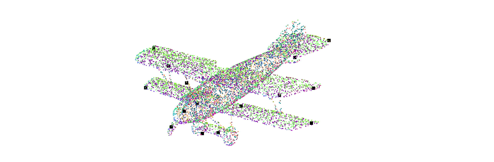
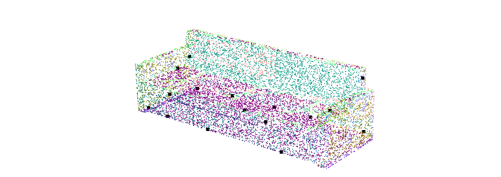

# Homework of Chapter 7
### How to run this code?
This code is based on ROS noetic on ubuntu 20.04. The homework completed by C++ and is tested by a node named "chapter_1" in package "small_projects".
1. Down load the whole workspace "3D_PointCloud_Processing".
2. Check or modify the source file /src/small_projects/src/chapter_1.cpp
3. Compile the package as follows.
   ```shell
   cd 3D_PointClud_Processing
   catkin_make
   ```
4. Run the chapter_1 node as follows, remember to replace the file path with your own ModelNet40 file path.
   ```shell
   source ./devel/setup.bash
   roscore
   # run below command in another terminal
   rosrun small_projects chapter_7 data/modelnet40_normal_resampled/airplane/airplane_0001.txt
   ```
### Result
airplane_0001.txt

sofa_0010.txt

monitor_0001.txt

### Key Code
#### API
All the algorithm is completed in a class named FeatureDetection defined in small_projects/include/chapter_7/feature_detection.h and small_projects/include/chapter_7/feature_detection.hpp. The API of FeatureDetection refer to small_projects/src/chapter_7.cpp as follows.
```C++
// small_projects/src/chapter_7.cpp

pcl::octree::OctreePointCloudSearch<pcl::PointXYZRGBA> octree(0.001f);
boost::shared_ptr<pcl::octree::OctreePointCloudSearch<pcl::PointXYZRGBA>> octree_ptr = boost::make_shared<pcl::octree::OctreePointCloudSearch<pcl::PointXYZRGBA>>(octree);
FeatureDetection fd;
std::vector<int> key_point_indices;
fd.setInputPointCloud(cloud);
fd.setOctree(octree_ptr);
fd.setFeatureDetectionMethod("ISS");
fd.setRnnRadius(longest_dist / 20);
fd.setNMSRadius(longest_dist / 10);
fd.execDetection();
fd.getKeyPointIndices(key_point_indices);
```
#### ISS
Steps of ISS:
1. calculate the weight
2. calculate the weighted cov matrix
3. calculate the eigenvalues of weighted cov matrix
4. filter the result with gamma21 and gamma32
5. NMS on the smallest eigenvalue of the filtered points
```C++
// small_projects/include/chapter_7/feature_detection.hpp

void FeatureDetection::execISS()
{
    int size = cloud_->size();
    key_points_after_filter_.clear();
    for (int point_index = 0; point_index < size; ++point_index) // go over all the points
    {
        // RNN search based on PCL octree
        std::vector<int> points_index_search;
        std::vector<float> points_radius_squared_distance;
        octree_->radiusSearch(cloud_->at(point_index), rnn_radius_, points_index_search, points_radius_squared_distance);
        
        float weight_sum = 0;
        Eigen::Matrix3f cov(Eigen::Matrix3f::Zero());
        Eigen::Vector3f query_point;
        query_point << cloud_->at(point_index).x, cloud_->at(point_index).y, cloud_->at(point_index).z;
        for (int neighboor_index = 0; neighboor_index < points_index_search.size(); ++neighboor_index) // go over all the neightboors
        {
            if (points_index_search.at(neighboor_index) != point_index)
            {
                // Step 1. calculate the weight for each neighboor
                float weight = 1 / std::sqrt(points_radius_squared_distance.at(neighboor_index));
                weight_sum += weight;
                Eigen::Vector3f neighboor_point;
                neighboor_point << cloud_->at(points_index_search.at(neighboor_index)).x, cloud_->at(points_index_search.at(neighboor_index)).y, cloud_->at(points_index_search.at(neighboor_index)).z;            
                cov += weight * (neighboor_point - query_point)*(neighboor_point - query_point).transpose();
            }
        }
        // Step 2. calculate the weighted covariance matrix for each query point
        cov = cov / weight_sum;

        // Step 3. calculate the eigen values of the covariance matrix
        Eigen::SelfAdjointEigenSolver<Eigen::Matrix3f> es(cov);
        std::vector<float> eigen_values = {es.eigenvalues()(0), es.eigenvalues()(1), es.eigenvalues()(2)};
        std::sort(eigen_values.begin(), eigen_values.end()); 

        // Step 4. fitler the key points based on the proposion of eigenvalues
        if (eigen_values.at(2)/eigen_values.at(1) > 2 && eigen_values.at(1)/eigen_values.at(0) > 2)
        {
            std::pair<int, float> point(point_index, eigen_values.at(0)); // the smallest eigen value
            key_points_after_filter_.push_back(point);
        }
    }

    // Step 5. NMS on filterd key points.
    NMS(key_points_after_filter_, key_points_after_NMS_);
};
```
#### NMS
Steps of NMS:
1. Sort the key points based on the smallest eigenvalues.
2. Move the point with max smallest eigenvalues from input key points contatiner into the final key points container.
3. Remove points if they are closed to the point, which is latest moved to final key points container.
```C++
// small_projects/include/chapter_7/feature_detection.hpp

void FeatureDetection::NMS(std::list<std::pair<int, float>>& input_points, std::vector<std::pair<int, float>>& output_points)
{
    // Step 1. sort the input data
    output_points.clear();
    input_points.sort(smaller);
    while (input_points.size() != 0)
    {
        // Step 2. move the data with max feature into output dataset
        std::pair<int, float> max_point = input_points.front(); 
        output_points.push_back(max_point);
        input_points.pop_front(); // remove the selected data from input dataset

        if (~input_points.empty())
        {
            auto iter = input_points.begin();
            while (iter != input_points.end())
            {
                // Step 3. remove the data if it is closed to the data with max feature
                Eigen::Vector3f max_point_coors, other_point_coors;
                max_point_coors << cloud_->points.at(max_point.first).x, cloud_->points.at(max_point.first).y,cloud_->points.at(max_point.first).z;
                other_point_coors << cloud_->points.at(iter->first).x, cloud_->points.at(iter->first).y, cloud_->points.at(iter->first).z;
                float distance = (max_point_coors - other_point_coors).norm();
                if (distance > nms_radius_) // if far
                {                
                    ++iter; // do not delete, iter point to the next pos
                }
                else // if close
                {
                    iter = input_points.erase(iter); // delete, and iter point to the next pos
                }
            }
        }
    }
};
```