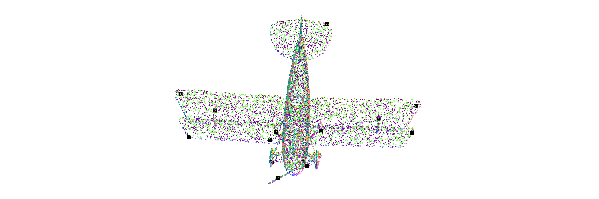
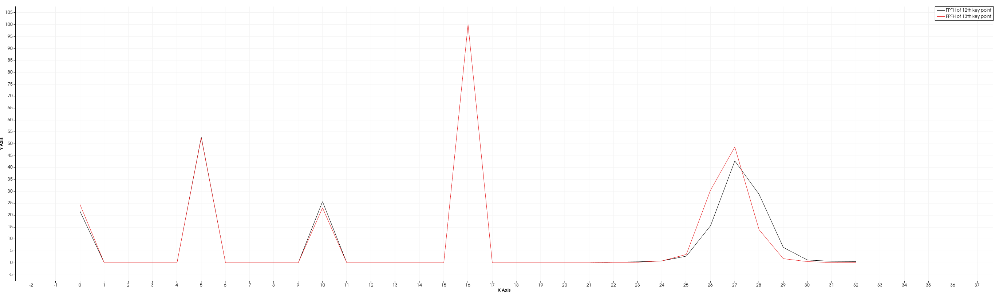

# Homework of Chapter 8
### How to run this code?
This code is based on ROS noetic on ubuntu 20.04. The homework completed by C++ and is tested by a node named "chapter_1" in package "small_projects".
1. Down load the whole workspace "3D_PointCloud_Processing".
2. Check or modify the source file /src/small_projects/src/chapter_8.cpp
3. Compile the package as follows.
   ```shell
   cd 3d_PointClud_Processing
   catkin_make
   ```
4. Run the chapter_8 node as follows, remember to replace the file path with your own ModelNet40 file path.
   ```shell
   source ./devel/setup.bash
   roscore
   # run below command in another terminal
   rosrun small_projects chapter_7 data/modelnet40_normal_resampled/airplane/airplane_0001.txt
   ```
### Result
本次作业选择 ModelNet40 中的 airplane_0001 作为例子。如下图所示，以第七章的算法，一共发现了15个特征点。

我们取第二层机翼最外侧的两个特征点。通过观察特征点的点云数据（如下），我们确定这两个特征点的 index 分别是11和12.
```
# .PCD v0.7 - Point Cloud Data file format
VERSION 0.7
FIELDS x y z rgba
SIZE 4 4 4 4
TYPE F F F U
COUNT 1 1 1 1
WIDTH 15
HEIGHT 1
VIEWPOINT 0 0 0 1 0 0 0
POINTS 15
DATA ascii
-0.66189998 0.019750001 0.1199 4278190080
0.077030003 -0.3026 0.3955 4278190080
-0.15530001 0.1039 0.32749999 4278190080
0.6631 0.0141 0.1248 4278190080
0.1035 0.096799999 0.60589999 4278190080
-0.001609 -0.34020001 -0.67739999 4278190080
-0.2132 -0.15459999 0.2836 4278190080
-0.18889999 -0.40059999 0.37630001 4278190080
0.2024 -0.168 0.17470001 4278190080
-0.1295 -0.09691 0.6408 4278190080
-0.86940002 -0.1294 0.29879999 4278190080
0.95700002 0.077430002 0.03115 4278190080 -> the 11th key point
-0.95029998 0.074239999 0.01123 4278190080 -> the 12th key point
0.949 -0.15549999 0.16060001 4278190080
0.2235 -0.28639999 -0.91579998 4278190080
```
画出 index 为11和12特征点的特征直方图，如下图所示，两个点的特征直方图非常相近，说明特征描述结果OK。

### Key Code
本次作业不涉及新的头文件，所有代码都在 small_projects/src/chapter_8.cpp 中，具体步骤如下：
1. 使用了第七章的算法提取特征点。
2. 使用了第一章的法线计算每个点的法向量。
3. 使用了 PCL 库中的 FPFH 描述子来描述特征点。
4. 使用了 PCL 库中的 PCLVisualizer 对原始点云和特征点点云进行可视化。
5. 使用了 PCL 库中的 PCLPlotter 对特征点的特征直方图进行可视化。
```C++
// small_projects/src/chapter_8.cpp

#include "chapter_1/modelnet40_reader.h"
#include "chapter_1/basic_algorithm.h"
#include "chapter_7/feature_detection.h"
#include "chapter_7/feature_detection.hpp"

#include <pcl/visualization/pcl_visualizer.h>
#include <pcl/visualization/pcl_plotter.h>
#include <pcl/common/common.h>
#include <pcl/features/fpfh.h>
#include <pcl/features/integral_image_normal.h>
#include <boost/thread/thread.hpp>

int main(int argc, char* argv[])
{
    // Read the ModelNet40 txt file
    std::string file_path = argv[1];
    // std::string file_path = "data/modelnet40_normal_resampled/monitor/monitor_0001.txt";
    // std::string pcd_file_path = argv[2];
    pcl::PointCloud<pcl::PointXYZRGBA>::Ptr cloud (new pcl::PointCloud<pcl::PointXYZRGBA>);
    ModelNet40Reader reader;
    reader.setInputFilePath(file_path);
    reader.setPointCloud(cloud);
    reader.read();
    reader.getPointCloud(cloud); // the raw point cloud

    // Feature Detection
    pcl::PointXYZRGBA minpt, maxpt;
    pcl::getMinMax3D(*cloud, minpt, maxpt);
    float longest_dist = std::sqrt((maxpt.x - minpt.x) * (maxpt.x - minpt.x) + (maxpt.y - minpt.y) * (maxpt.y - minpt.y) + (maxpt.z - minpt.z) * (maxpt.z - minpt.z));
    std::cout << "Longest distance = " << longest_dist << std::endl;
    
    // Feature Detection
    pcl::octree::OctreePointCloudSearch<pcl::PointXYZRGBA> octree(0.001f);
    boost::shared_ptr<pcl::octree::OctreePointCloudSearch<pcl::PointXYZRGBA>> octree_ptr = boost::make_shared<pcl::octree::OctreePointCloudSearch<pcl::PointXYZRGBA>>(octree);
    FeatureDetection fd; // chapter 7
    pcl::PointIndices::Ptr key_point_indices (new pcl::PointIndices);
    fd.setInputPointCloud(cloud);
    fd.setOctree(octree_ptr);
    fd.setFeatureDetectionMethod("ISS");
    fd.setRnnRadius(longest_dist / 20);
    fd.setNMSRadius(longest_dist / 10);
    fd.execDetection();
    fd.getKeyPointIndices(key_point_indices);

    // estimate the normals
    pcl::PointCloud<pcl::Normal>::Ptr normals (new pcl::PointCloud<pcl::Normal>);
    BasicAlgorithm ba; // chapter 1
    ba.setInputPointCloud(cloud);
    ba.setOutputNormals(normals);
    ba.estimateNormal(longest_dist / 20);
    ba.getNormals(normals);
    
    // calculate the FPFH using PCL
    pcl::search::KdTree<pcl::PointXYZRGBA>::Ptr tree_ptr(new pcl::search::KdTree<pcl::PointXYZRGBA>);
    pcl::PointCloud<pcl::FPFHSignature33>::Ptr fpfhs_ptr(new pcl::PointCloud<pcl::FPFHSignature33>());
    pcl::FPFHEstimation<pcl::PointXYZRGBA, pcl::Normal, pcl::FPFHSignature33> fpfh;
    fpfh.setInputCloud(cloud);
    fpfh.setInputNormals(normals);
    fpfh.setIndices(key_point_indices);
    fpfh.setSearchMethod(tree_ptr);
    fpfh.setRadiusSearch(longest_dist / 20);
    fpfh.compute(*fpfhs_ptr);

    // Build the point cloud with key point indices
    pcl::PointCloud<pcl::PointXYZRGBA>::Ptr key_cloud (new pcl::PointCloud<pcl::PointXYZRGBA>);
    key_cloud->width = key_point_indices->indices.size();
    key_cloud->height = 1;
    key_cloud->points.resize(key_cloud->width * key_cloud->height);
    std::cout << "key points indices: ";
    for (int point_index = 0; point_index < key_cloud->width; ++point_index)
    {
        key_cloud->points.at(point_index).x = cloud->at(key_point_indices->indices.at(point_index)).x;
        key_cloud->points.at(point_index).y = cloud->at(key_point_indices->indices.at(point_index)).y;
        key_cloud->points.at(point_index).z = cloud->at(key_point_indices->indices.at(point_index)).z;
        key_cloud->points.at(point_index).r = 0; // set color is black
        key_cloud->points.at(point_index).g = 0;
        key_cloud->points.at(point_index).b = 0;
        std::cout << key_point_indices->indices.at(point_index) << ", ";
    }
    std::cout << std::endl;
    pcl::io::savePCDFileASCII("data/modelnet40_normal_resampled/test/test_0001.pcd", *key_cloud);

    // point cloud visuliation 
    boost::shared_ptr<pcl::visualization::PCLVisualizer> data_viewer (new pcl::visualization::PCLVisualizer("data_viewer"));
    data_viewer->setBackgroundColor(1,1,1);
    // data_viewer->addCoordinateSystem();
    data_viewer->addPointCloud<pcl::PointXYZRGBA> (cloud, "raw_cloud"); // visulize downsampled point cloud
    data_viewer->setPointCloudRenderingProperties(pcl::visualization::PCL_VISUALIZER_POINT_SIZE, 5, "raw_cloud");
    data_viewer->addPointCloud<pcl::PointXYZRGBA> (key_cloud, "key_cloud"); // visulize downsampled point cloud
    data_viewer->setPointCloudRenderingProperties(pcl::visualization::PCL_VISUALIZER_POINT_SIZE, 20, "key_cloud");
    // data_viewer->addPointCloudNormals <pcl::PointXYZRGBA, pcl::Normal> (cloud, normals, 1, 0.05, "normals");

    // FPFH visulization
    pcl::visualization::PCLPlotter::Ptr plotter (new pcl::visualization::PCLPlotter("FPFH plotter"));
    plotter->setShowLegend(true);
    plotter->addFeatureHistogram<pcl::FPFHSignature33>(*fpfhs_ptr, "fpfh",11, "FPFH of 12th key point");
    plotter->addFeatureHistogram<pcl::FPFHSignature33>(*fpfhs_ptr, "fpfh",12, "FPFH of 13th key point");
    plotter->spinOnce(100);

    while (!data_viewer->wasStopped()) // keep viewer
    {
        data_viewer->spinOnce(100);
        boost::this_thread::sleep(boost::posix_time::microseconds(100000));
    }

    return 0;
}
```